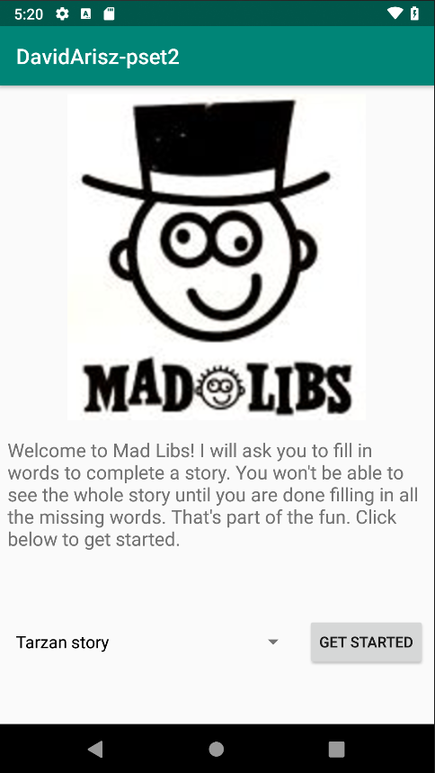
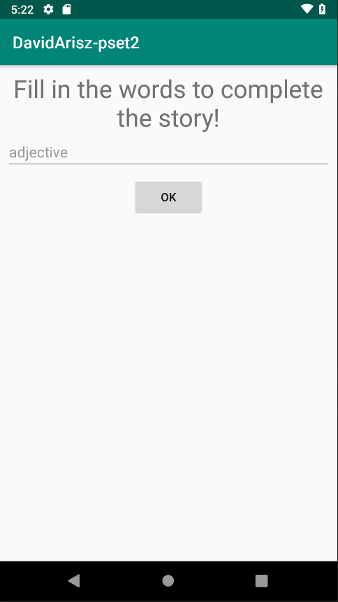
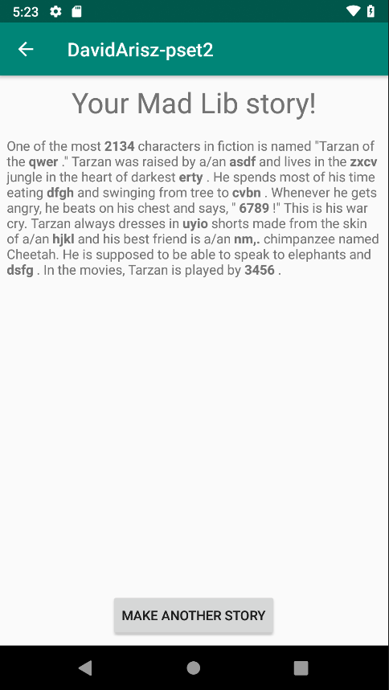
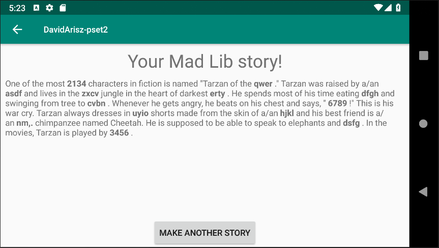

# DavidArisz_pset2

This app let's you put words into a story so that it'll be your unique story!

You will be able to choose one of 5 stories, after which you will see what type (adjective, noun, etc) you need to fill in so that
the story still makes sense. After you have filled in all the words the app will show you the completed story with all your words
in bold so that you can see exactly which words were your own.

 

